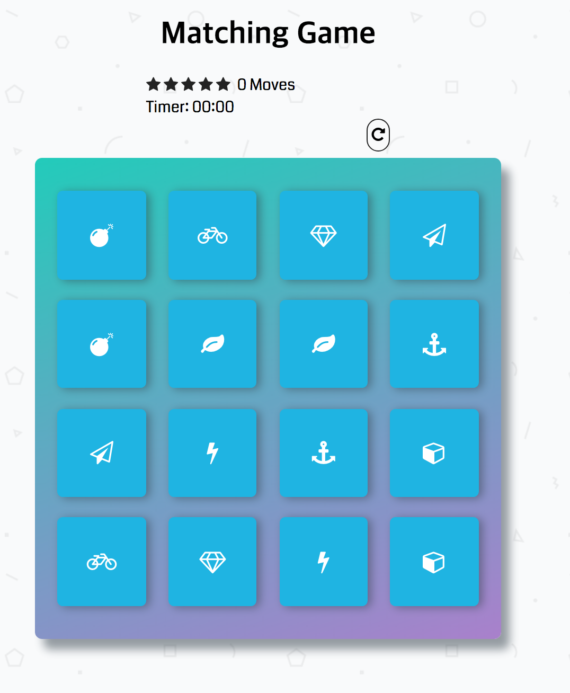

# Memory Game Project

## Table of Contents

* [Preview](#preview)
* [Instructions](#instructions)
* [Contributing](#contributing)

## Preview
 

## Instructions

The ultimate matching game provides you the most fun experience you might have!

1. When the page loads, look carefully and try to memorize matching symbols as many as you can!

2. After all symbols are disappeared, you can now use your brain and guess where matching cards are.

3. If cards match, the colors changed to blue!

4. If all cards match, You win and you can check how many turns & time spent!

 * 5 Stars - less than 11 Moves
 * 4 Stars - less than 16 Moves
 * 3 Stars - less than 21 Moves
 * 2 Stars - less than 26 Moves
 * 1 Stars - More than 26 Moves

 To play again, just click the playAgain button on the modal.

## Contributing

This repository is the starter code for _all_ Udacity students. Therefore, we most likely will not accept pull requests.
